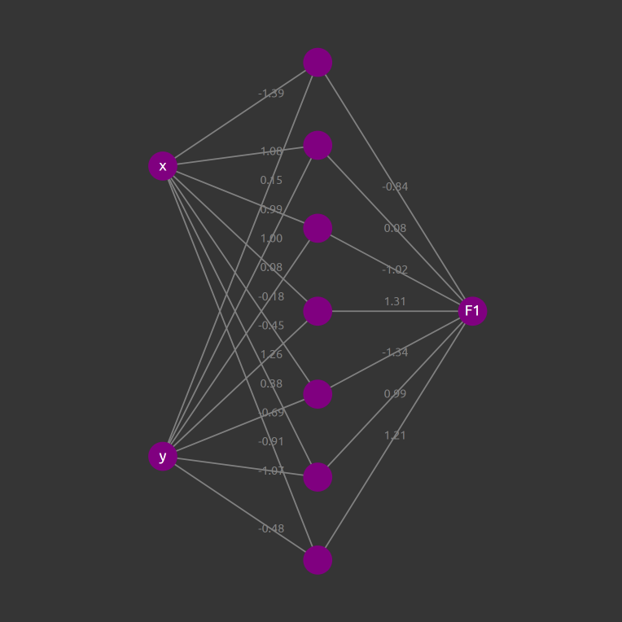

Neural Network
=============

This is an interactive visualization of an artificial neural network designed for regression. It supports modification of the network and the specification of arbitrary functions to approximate. Learning is based on stochastic gradient descent on the stream of random sampled values. 

[See it in action.](https://zongzhengli.github.io/neural-network)

